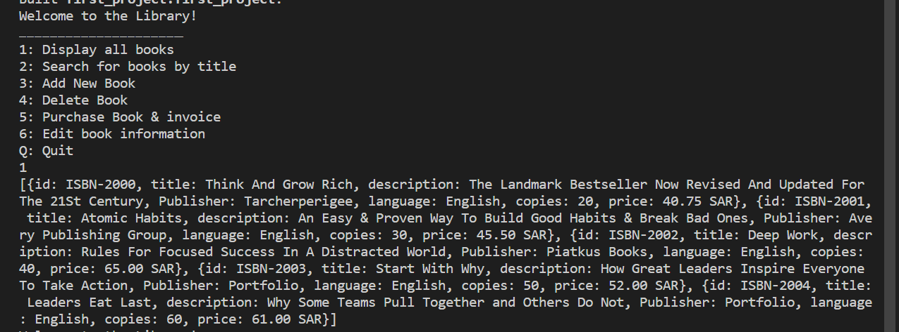
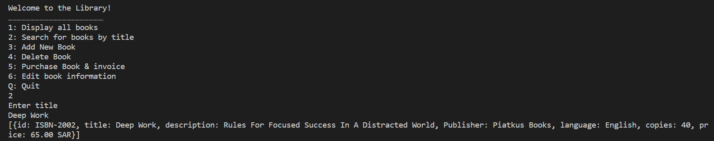
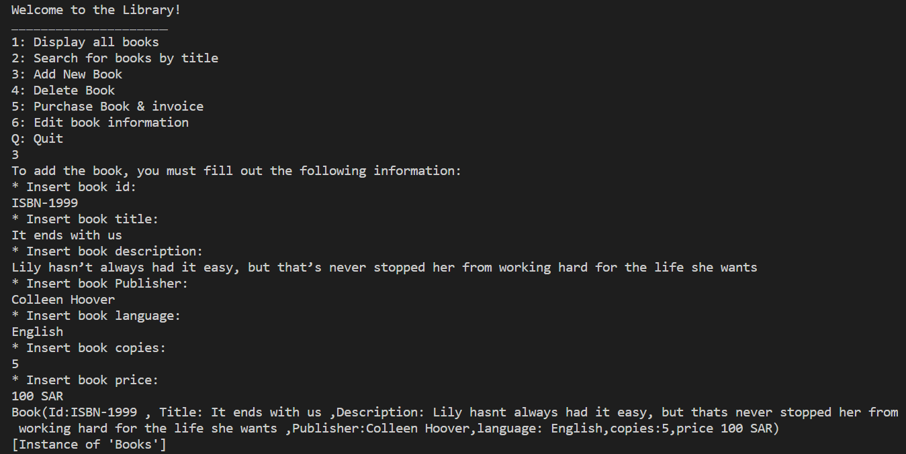
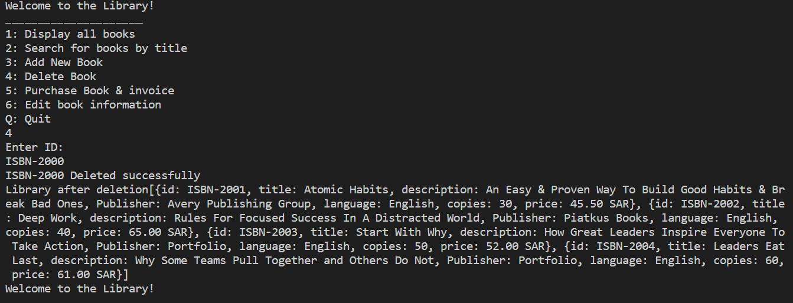
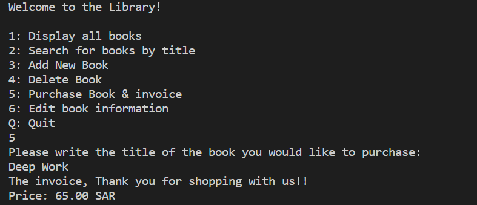
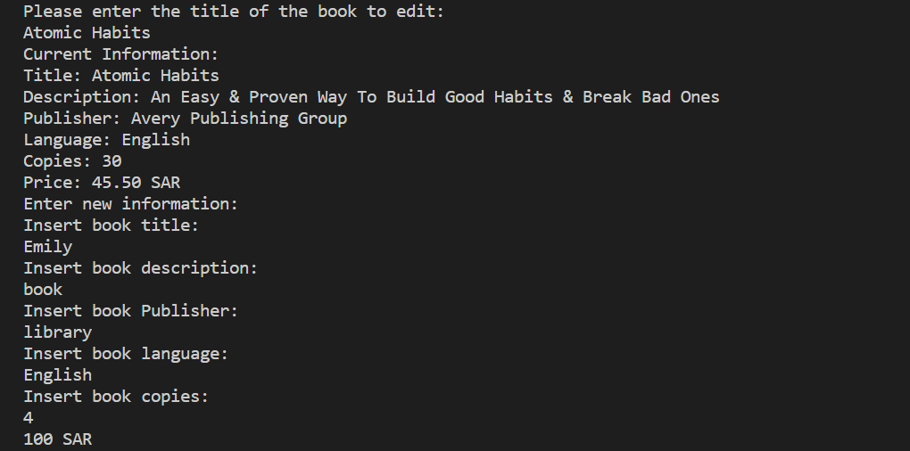
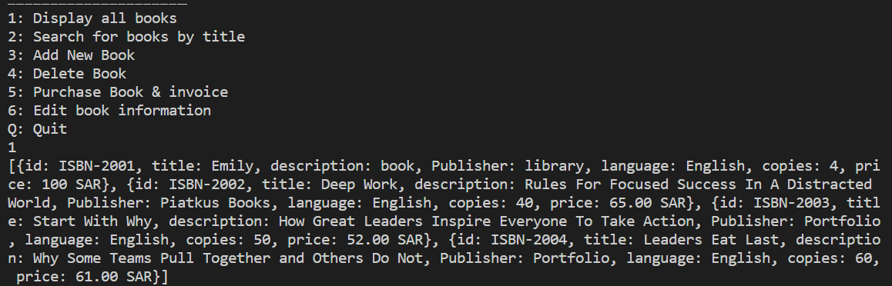
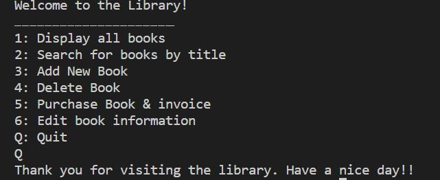

Hi everyone here is my first project at the Flutter bootcamp

The Book Library Project

A simple command-line project that provides multiple services ..

these services are :

    1: Display all books
    2: Search for books by title
    3: Add New Book
    4: Delete Book
    5: Purchase Book & invoice
    6: Edit book information
    Q: Quit

-first service is to Display all books:

-second service is to Search for a book by it's title:

-third service is to Add a New Book and then you can display all books again and the new book is added to the list :

-fourth service is to Delete Book and then you can display all books again and the deleted book is gone from the list :

-fifth service is to Purchase a Book & show the invoice:

-sixth service is to Edit a book's information and then you can display all books again and the edited book information is updated :

-and lastly you can press Q (Quit) to exit the project :
 

 thank you !

